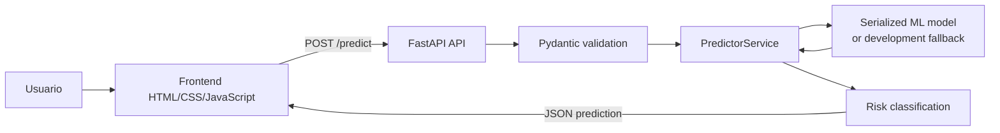

# Informe técnico — Persona 2: Software Engineer

## 1. Arquitectura de la aplicación

La aplicación entrega predicciones individuales de abandono de clientes mediante una API REST construida con FastAPI y una interfaz web estática servida por la misma aplicación. La responsabilidad de esta capa es validar el contrato de entrada, convertirlo al formato de inferencia y presentar el resultado; no entrena ni reentrena el modelo.



La estructura bajo `/app` separa responsabilidades:

| Ruta | Responsabilidad |
| --- | --- |
| `main.py` | Punto de entrada ASGI. Construye la instancia FastAPI, registra rutas, manejadores globales de errores y publica el frontend. |
| `api/` | Contratos Pydantic en `schemas.py` y definición HTTP de los endpoints en `routes.py`. Los endpoints delegan la inferencia al servicio. |
| `services/` | Lógica de negocio independiente del transporte HTTP: carga e inferencia del modelo (`predictor.py`) y clasificación de riesgo (`risk.py`). |
| `core/` | Configuración mediante variables de entorno (`config.py`) y excepciones/manejadores de errores comunes (`exceptions.py`). |
| `frontend/` | Interfaz estática: formulario de cliente, llamada `fetch` al endpoint y tabla de predicciones realizadas durante la sesión del navegador. |
| `tests/` | Pruebas unitarias y de endpoint. Usan un modelo mock, por lo que no requieren el artefacto real del equipo de ML. |
| `Dockerfile` | Definición de una imagen ejecutable de la aplicación. |

## 2. Endpoints de la API

### `GET /health`

Comprueba la disponibilidad de la aplicación y del servicio de inferencia. No recibe cuerpo de petición.

Respuesta exitosa (`200 OK`):

```json
{
  "status": "ok",
  "model_loaded": true,
  "model_source": "artifact"
}
```

`model_source` puede ser `artifact` si se cargó el archivo configurado, `fallback` si está activo el modelo local de demostración, o `injected` cuando se inyecta un modelo en pruebas. El estado es `ok` mientras exista un modelo disponible; de lo contrario sería `degraded`.

### `POST /predict`

Valida un cliente, llama al modelo y devuelve la probabilidad de churn junto con una banda de riesgo. Recibe JSON:

```json
{
  "CustomerID": "C-100",
  "Age": 35,
  "Gender": "Female",
  "Tenure": 12,
  "Usage Frequency": 15,
  "Support Calls": 2,
  "Payment Delay": 3,
  "Subscription Type": "Premium",
  "Contract Length": "Annual",
  "Total Spend": 650.5,
  "Last Interaction": 4
}
```

Respuesta exitosa (`200 OK`):

```json
{
  "customer_id": "C-100",
  "churn_probability": 0.78,
  "risk_level": "High"
}
```

La probabilidad se redondea a cuatro decimales en la respuesta. La clasificación implementada es: `Low` para valores menores de 0.35, `Medium` desde 0.35 hasta menos de 0.65 y `High` desde 0.65.

### `GET /customers`

Es un endpoint reservado para una futura lista de predicciones o clientes persistidos. Actualmente no recibe parámetros y devuelve siempre una lista vacía:

```json
[]
```

**Pendiente / trabajo futuro:** no existe todavía una base de datos, repositorio ni persistencia de clientes. La tabla del frontend conserva resultados solamente en el DOM de la sesión actual.

## 3. Integración con el modelo de ML

La clase `PredictorService` lee `MODEL_PATH` y carga el artefacto mediante `joblib.load()`. El objeto proporcionado por Persona 1 debe exponer `predict_proba(features)` y devolver una estructura binaria donde la columna/posición `[0][1]` es la probabilidad de churn. Se recomienda entregar un pipeline serializado que incluya el preprocesamiento, para que encoding y transformaciones se apliquen de la misma forma que durante el entrenamiento.

Antes de inferir, el servicio elimina `CustomerID` y crea un `pandas.DataFrame` de una fila. Por defecto, las columnas enviadas al modelo son:

```text
Age, Gender, Tenure, Usage Frequency, Support Calls, Payment Delay,
Subscription Type, Contract Length, Total Spend, Last Interaction
```

La ruta opcional `FEATURE_LIST_PATH` permite suministrar el orden/nombre de columnas como una lista JSON o como `{"features": [...]}`. Si el contrato del modelo cambia, se debe actualizar conjuntamente esa lista y los aliases/validaciones de `api/schemas.py`.

Variables relevantes:

| Variable | Comportamiento |
| --- | --- |
| `MODEL_PATH` | Ubicación del archivo joblib/pickle. Localmente el valor por defecto apunta a `../model/model.pkl` respecto a la carpeta `app`. |
| `ALLOW_FALLBACK_MODEL` | Si es `true` y no se puede cargar el artefacto, activa `FallbackChurnModel`, un modelo heurístico determinista para desarrollo. |
| `FEATURE_LIST_PATH` | Ruta opcional al archivo JSON con el contrato de columnas. |

Con `ALLOW_FALLBACK_MODEL=false`, un archivo ausente, ilegible o inválido impide inicializar el predictor y se genera un error de modelo no disponible. El fallback no es un modelo entrenado y no debe usarse para decisiones de producción. El Dockerfile lo desactiva de forma predeterminada.

## 4. Validación y manejo de errores

Pydantic valida el cuerpo de `POST /predict` antes de llamar al modelo. Los campos requeridos son todos los del ejemplo de cliente. Las principales reglas son:

| Campo | Regla implementada |
| --- | --- |
| `CustomerID` | Texto obligatorio, de 1 a 128 caracteres. |
| `Age` | Entero entre 18 y 120. |
| `Gender` | Exactamente `Male` o `Female`. |
| `Tenure` | Entero entre 0 y 1200. |
| `Usage Frequency`, `Support Calls` | Enteros entre 0 y 10000. |
| `Payment Delay`, `Last Interaction` | Enteros entre 0 y 3650. |
| `Subscription Type`, `Contract Length` | Texto obligatorio; tras quitar espacios no puede estar vacío y tiene máximo 100 caracteres. |
| `Total Spend` | Número entre 0 y 10 000 000. |

Los manejadores globales devuelven JSON uniforme:

| Código | Significado |
| --- | --- |
| `200` | Petición procesada correctamente. |
| `422` | Falló la validación Pydantic. La respuesta contiene `detail: "Input validation failed"` y una lista `errors` con los campos y reglas incumplidos. |
| `500` | No hay modelo disponible, el modelo no produjo una predicción válida o ocurrió un error interno inesperado. Se devuelve `detail` con una descripción segura del problema. |

La aplicación usa el módulo estándar `logging` para registrar errores de modelo, errores de inferencia y errores inesperados; no usa `print`.

## 5. Pruebas de funcionamiento

La suite se ejecuta desde `/app`:

```powershell
python -m pytest -q
```

Los casos actuales son:

| Archivo | Cobertura |
| --- | --- |
| `test_predict_endpoint.py` | `POST /predict` con cliente válido (200 y riesgo `High` con el mock) y con edad inválida (422 y mensaje de validación). |
| `test_health_endpoint.py` | `GET /health` informa estado `ok`, modelo cargado y fuente `injected`. |
| `test_predictor_service.py` | `PredictorService` crea el DataFrame y consume correctamente `predict_proba` del modelo mock. |
| `test_risk_classification.py` | Bandas Low/Medium/High, casos límite 0.35 y 0.65, y rechazo de probabilidad fuera de [0, 1]. |
| `conftest.py` | Cliente FastAPI, cliente de ejemplo y modelo mock reutilizables. |

El resultado esperado es una suite exitosa sin depender de `model.pkl`. En la versión implementada se obtienen 11 pruebas aprobadas.

## 6. Despliegue con Docker

El `Dockerfile`:

1. Parte de `python:3.11-slim`.
2. Define variables de ejecución: salida Python sin búfer, `PORT=8000`, `MODEL_PATH=/opt/model/model.pkl` y fallback desactivado.
3. Establece `/opt/app` como directorio de trabajo.
4. Copia e instala `requirements.txt` sin caché de pip.
5. Copia el código de `/app`, expone el puerto 8000 y ejecuta Uvicorn enlazado a `0.0.0.0`.

Desde la raíz del repositorio:

```powershell
docker build -t churn-risk-app -f app/Dockerfile app
docker run --rm -p 8000:8000 -e MODEL_PATH=/opt/model/model.pkl -v "${PWD}/model:/opt/model:ro" churn-risk-app
```

El volumen monta el artefacto producido por Persona 1 en modo solo lectura. Para producción se debe conservar `ALLOW_FALLBACK_MODEL=false`, especificar una ruta de modelo accesible y definir, si corresponde, `FEATURE_LIST_PATH`. `PORT` modifica el puerto de Uvicorn dentro del contenedor; si se modifica, también debe ajustarse el mapeo `-p`.

## 7. Guía de inicio para un integrante nuevo

1. Ubicarse en la carpeta de aplicación:

   ```powershell
   cd "D:\PROYECTO MAESTRIA\trabajo-machine-learning\app"
   ```

2. Crear y activar un entorno virtual:

   ```powershell
   python -m venv .venv
   .venv\Scripts\Activate.ps1
   ```

3. Instalar dependencias y crear configuración local:

   ```powershell
   pip install -r requirements.txt
   Copy-Item .env.example .env
   ```

4. Para desarrollo sin artefacto ML, mantener `ALLOW_FALLBACK_MODEL=true` en `.env`. Para usar el modelo real, establecer `MODEL_PATH` con su ruta y preferiblemente definir `ALLOW_FALLBACK_MODEL=false`.

5. Ejecutar pruebas:

   ```powershell
   python -m pytest -q
   ```

6. Iniciar el servidor:

   ```powershell
   uvicorn main:app --reload --port 8000
   ```

7. Abrir `http://localhost:8000` para la interfaz o `http://localhost:8000/docs` para probar la API mediante OpenAPI.

Antes de conectar el artefacto de Persona 1 en producción, el equipo debe confirmar el orden exacto de features, categorías válidas y que la clase positiva de `predict_proba` corresponde realmente a churn.
